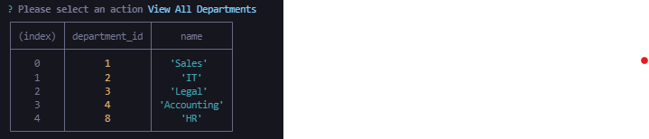
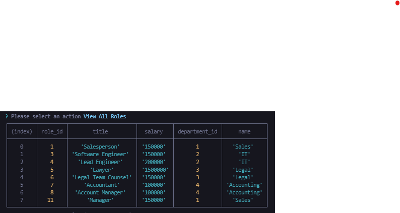
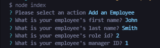
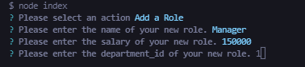
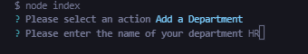

    
# Employee Tracker

## Description

Employee tracker is a node.js application that allows you to store, view, update and delete employee, department and role data.

## Table of Contents

[title](#title)
[description](#description)
[installation](#installation)
[usage](#usage)
[contributing](#contributing)
[email](#email)
[github](#github)

## Installation

Employee Tracker requires node.js to be installed. For instructions on how to do so, refer to the documentation:

https://nodejs.dev/learn/how-to-install-nodejs

## Usage 

Employee tracker is a node.js application that allows you to store, view, update and delete employee, department and role data. Start the application by running the index.js file in a bash terminal. The user will be prompted to choose an action.

### Viewing employees, departments and roles

The user can choose to view all departments, view all employees, view all roles, add a role, add an employee, update an employee, view employees by manager, delete a role, delete a department, or delete an employee.

Choosing to view all employees will display the following menu:

Similarly, selecting 'view all departments' or 'view all roles' will display the following menus, respectively:

### Adding and updating employees, departments and roles

Users can also choose to add an employee, department or role. Selecting this option will require the user to input data for each column contained in the relevant tables.

The process for updating employee, department or role information is similar. Users will select the desired option and answer the prompts that follow.

### Deleting employees, departments or roles

Finally, users can choose to remove any employee, department or role by selecting the option in the main menu of the application.  

## Contributing

Feel free to leave suggestions in the Slack channel.

## Questions

Feel free to shoot me any questions at the email below:

rrich.kray@gmail.com

find my GitHub profile by following the link below:

https://github.com/rrich-kray/