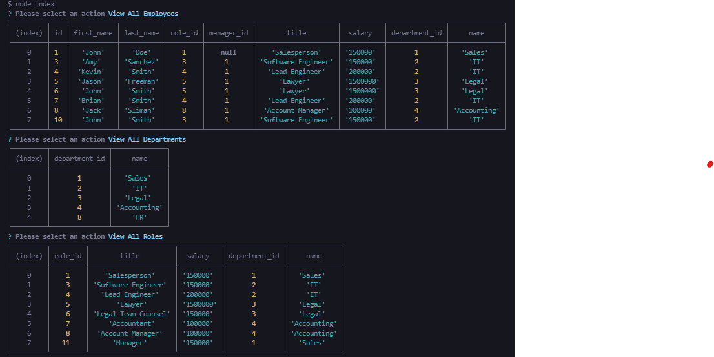
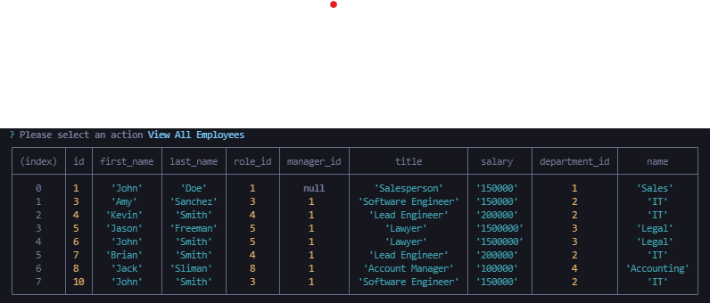
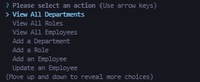

    
# Employee Tracker

## Description

Employee tracker is a node.js application that allows you to store, view, update and delete employee, department and role data.

## Table of Contents

[title](#title)
[description](#description)
[installation](#installation)
[usage](#usage)
[contributing](#contributing)
[email](#email)
[github](#github)

## Installation

Employee Tracker requires node.js to be installed. For instructions on how to do so, refer to the documentation:

https://nodejs.dev/learn/how-to-install-nodejs

## Usage 

Employee tracker is a node.js application that allows you to store, view, update and delete employee, department and role data. All data is stored within an SQL database; tables therein adhere to the following schema:

Start the application by running the index.js file in a bash terminal. The user will be prompted to choose one of the following actions:

Users can choose to view all employees, departments, or roles. Choosing each will display the following menus, respectively:

Users can also add an employee, department or role. Selecting any of these options will require the user to input data for each table column found in the schema provided above.

The process for updating employee, department or role information is similar. Users will select the desired option and answer the prompts that follow.

Finally, users can choose to remove any employee, department or role by selecting the appropriate ID when prompted. All functionality heretofor described are executed using SQL queries.

## Contributing

Feel free to leave suggestions in the Slack channel.

## Questions

Feel free to shoot me any questions at the email below:

rrich.kray@gmail.com

find my GitHub profile by following the link below:

https://github.com/rrich-kray/