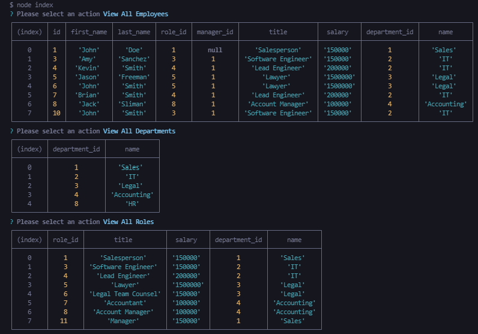

# Employee Tracker

This repository contains the source code for my Employee Tracker project.

## Description

Employee Tracker provides users a means to store, view, update and delete employee, department and role data. While challenging, this was a great opportunity to work with a relational database and its API without the need for any front-end integration. That said, I do intend to integrate this application into a React-built front-end and deploy it in the near future.

## Table of Contents

[Description](#description)  
[Installation](#installation)  
[How It Works](#how-it-works)  
[Usage](#usage)  
[Contact](#contact)  
[Questions](#questions)

## Installation

This application requires Node.js. Installation instructions can be found in the link below.

https://nodejs.dev/learn/how-to-install-nodejs

## How It Works

The application utilizes a SQL relational database to store data and the MySQL2 package to perform SQL queries. in lieu of a frontend, the inquirer package is used to accept user input.

Start the application by running the index.js file in a bash terminal. The user will be prompted to choose one of the following actions:

Users can choose to view all employees, departments, or roles. Choosing each will display the following menus, respectively:

Users can also add an employee, department or role. Selecting any of these options will require the user to input data for each table column found in the schema provided above.

The process for updating employee, department or role information is similar. Users will select the desired option and answer the prompts that follow.

Finally, users can choose to remove any employee, department or role by selecting the appropriate ID when prompted.

## Usage

Usage is demonstrated in the following video:

https://drive.google.com/file/d/13BPb2DhXy1QZuF3k0BtTz8EG0fhQwskz/view

## Contact

Email: rrich.kray.93@gmail.com

GitHub: https://github.com/rrich-kray/

Portfolio:

## License

Copyright (c) 2022, Ryan Kray
All rights reserved.

This source code is licensed under the BSD-style license found in the LICENSE file in the root directory of this source tree and reproduced below.

Redistribution and use in source and binary forms, with or without modification, are permitted provided that the following conditions are met:

1. Redistributions of source code must retain the above copyright notice, this list of conditions and the following disclaimer.
2. Redistributions in binary form must reproduce the above copyright notice, this list of conditions and the following disclaimer in the documentation and/or other materials provided with the distribution.
3. All advertising materials mentioning features or use of this software
   must display the following acknowledgement: This product includes software developed by Ryan Kray.
4. Neither the name of this application's developer nor the names of its contributors may be used to endorse or promote products derived from this software without specific prior written permission.

THIS SOFTWARE IS PROVIDED BY THE COPYRIGHT HOLDER ''AS IS'' AND ANY EXPRESS OR IMPLIED WARRANTIES, INCLUDING, BUT NOT LIMITED TO, THE IMPLIED WARRANTIES OF MERCHANTABILITY AND FITNESS FOR A PARTICULAR PURPOSE ARE DISCLAIMED. IN NO EVENT SHALL THE COPYRIGHT HOLDER OR CONTRIBUTORS BE LIABLE FOR ANY DIRECT, INDIRECT, INCIDENTAL, SPECIAL, EXEMPLARY, OR CONSEQUENTIAL DAMAGES (INCLUDING, BUT NOT LIMITED TO, PROCUREMENT OF SUBSTITUTE GOODS OR SERVICES; LOSS OF USE, DATA, OR PROFITS; OR BUSINESS INTERRUPTION) HOWEVER CAUSED AND ON ANY THEORY OF LIABILITY, WHETHER IN CONTRACT, STRICT LIABILITY, OR TORT (INCLUDING NEGLIGENCE OR OTHERWISE) ARISING IN ANY WAY OUT OF THE USE OF THIS SOFTWARE, EVEN IF ADVISED OF THE POSSIBILITY OF SUCH DAMAGE.
